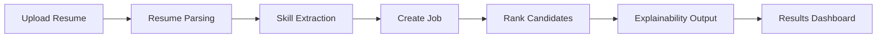

# AI-Powered Resume-Job Matching Hiring Intelligence System

Professional HRTech project for resume parsing, job posting management, candidate ranking, and explainable hiring decisions.

## Project Summary

This repository contains a complete full-stack hiring intelligence platform with:

- Frontend: interactive web UI for uploading resumes, creating jobs, ranking candidates, and viewing explanations.
- Backend: FastAPI APIs for candidate processing, job management, ranking, and explainability.
- Single-command launcher: Flask gateway that serves frontend and proxies backend API.
- Evaluation-ready documentation and commit-plan records.

## Evaluation Snapshot

| Item | Status |
|---|---|
| Source code completeness | Available in this repository |
| Frontend + Backend integration | Implemented |
| API documentation | `http://localhost:5000/docs` (via gateway) |
| Single command startup | `python flask_gateway.py` |
| Test suite | `backend/tests/test_backend.py` |
| Commit tracking plan | `docs/commit-plan/` |

## Interactive Project Flow



## Interactive UI Walkthrough

<details>
<summary><strong>Tab 1 - Upload Resume</strong></summary>

- Upload PDF, DOCX, or TXT resume.
- Extract candidate profile and skills.
- Store candidate for ranking.

</details>

<details>
<summary><strong>Tab 2 - Create Job</strong></summary>

- Enter role details, level, years of experience, and required skills.
- Job is saved and appears in the created jobs list.

</details>

<details>
<summary><strong>Tab 3 - Rank Candidates</strong></summary>

- Select a job and run candidate ranking.
- Weighted scoring combines skills, experience, and seniority.

</details>

<details>
<summary><strong>Tab 4 - Results and Explanation</strong></summary>

- Ranked list with per-score breakdown.
- Candidate-level explanation modal for decision transparency.

</details>

## Architecture

### Frontend
- `index.html`
- `index_professional.html`

### Gateway
- `flask_gateway.py`
- Serves frontend at `http://localhost:5000`
- Proxies API requests from `/api/*` to backend

### Backend
- `backend/app/main.py`
- `backend/app/apis/` for API routes
- `backend/app/services/` for parsing, skill extraction, ranking, and explainability
- `backend/app/models/` and `backend/app/schemas/`

## Repository Structure

```text
hrtech-platform/
|-- index.html
|-- index_professional.html
|-- flask_gateway.py
|-- README_STARTUP.md
|-- docs/
|   `-- commit-plan/
|       |-- 30-day-commit-plan.md
|       |-- daily-commit-log.md
|       `-- README.md
`-- backend/
	|-- app/
	|   |-- main.py
	|   |-- apis/
	|   |-- services/
	|   |-- models/
	|   `-- schemas/
	|-- tests/
	|-- requirements.txt
	`-- README.md
```

## How This Project Is Maintained for Faculty Evaluation

The repository is maintained to support clear academic/technical evaluation:

1. Clean source tracking: generated files are excluded through `.gitignore`.
2. Structured commits: feature and fix commits are separated with clear messages.
3. Daily progress artifacts: `docs/commit-plan/` includes planning and execution logs.
4. Reproducible startup: single command launcher for consistent demo.
5. Backend test availability: test module included for validation.
6. Modular architecture: APIs, services, models, and schemas are separated for readability.

## Detailed Run Guide

This section is written for first-time evaluators and faculty review.

### 1. Prerequisites

- Windows PowerShell
- Python 3.11+ (project also runs on your current setup with Python 3.13)
- Internet connection (first run downloads packages/models)

### 2. First-Time Setup (One Time Only)

From project root:

```powershell
cd "c:\Users\Sumit\Downloads\mini projecttt\hrtech-platform"
python -m venv ..\.venv
& "c:\Users\Sumit\Downloads\mini projecttt\.venv\Scripts\Activate.ps1"
python -m pip install --upgrade pip
```

Install required runtime packages:

```powershell
python -m pip install flask requests fastapi uvicorn sqlalchemy python-multipart pydantic pydantic-settings
python -m pip install PyPDF2 python-docx pypdf spacy sentence-transformers transformers scikit-learn torch
python -m spacy download en_core_web_sm
```

### 3. Start Entire Project (Frontend + Backend) With One Command

```powershell
cd "c:\Users\Sumit\Downloads\mini projecttt\hrtech-platform"
& "c:\Users\Sumit\Downloads\mini projecttt\.venv\Scripts\python.exe" flask_gateway.py
```

Open in browser:

- App UI: `http://localhost:5000`
- Health check: `http://localhost:5000/health`
- API docs: `http://localhost:5000/docs`

### 4. Daily Run (After Initial Setup)

```powershell
cd "c:\Users\Sumit\Downloads\mini projecttt\hrtech-platform"
& "c:\Users\Sumit\Downloads\mini projecttt\.venv\Scripts\python.exe" flask_gateway.py
start http://localhost:5000
```

### 5. Stop the Project

- Press `Ctrl+C` in the terminal where `flask_gateway.py` is running.

### 6. Manual Mode (Optional)

If you want backend separately:

```powershell
cd "c:\Users\Sumit\Downloads\mini projecttt\hrtech-platform\backend"
& "c:\Users\Sumit\Downloads\mini projecttt\.venv\Scripts\python.exe" -m uvicorn app.main:app --reload --host 0.0.0.0 --port 8000
```

Then open frontend file directly (`index.html` or `index_professional.html`) and ensure backend URL is reachable.

### 7. Troubleshooting (Quick)

<details>
<summary><strong>Issue: ModuleNotFoundError</strong></summary>

Install missing packages into the same `.venv`:

```powershell
& "c:\Users\Sumit\Downloads\mini projecttt\.venv\Scripts\python.exe" -m pip install <package-name>
```

</details>

<details>
<summary><strong>Issue: localhost:5000 not opening</strong></summary>

Check health:

```powershell
Invoke-WebRequest http://localhost:5000/health -UseBasicParsing
```

If down, start gateway again with the one command above.

</details>

<details>
<summary><strong>Issue: Port already in use</strong></summary>

Close old Python terminals running gateway/backend, then restart gateway.

</details>

## API Endpoints (Core)

| Domain | Endpoint |
|---|---|
| Candidates | `POST /api/candidates/upload-resume` |
| Candidates | `GET /api/candidates/list` |
| Jobs | `POST /api/jobs/create` |
| Jobs | `GET /api/jobs/list` |
| Ranking | `POST /api/ranking/rank-candidates` |
| Ranking | `GET /api/ranking/ranking-details/{ranking_id}` |

## Validation and Testing

Run backend tests:

```powershell
cd backend
python -m pytest tests/test_backend.py -v
```

## Notes

- Runtime-generated artifacts such as local DB/cache files are intentionally not tracked.
- If optional ML components are unavailable in a local environment, the system still supports fallback ranking flow.

## Author

- Sumit Singh (`sumitaiml`)

## Update Note

This README has been updated for better clarity.
